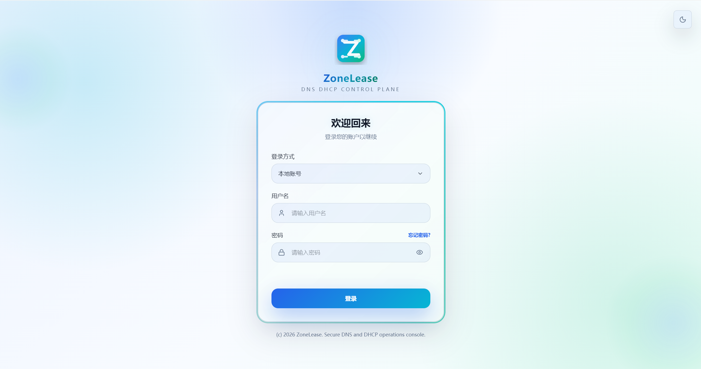
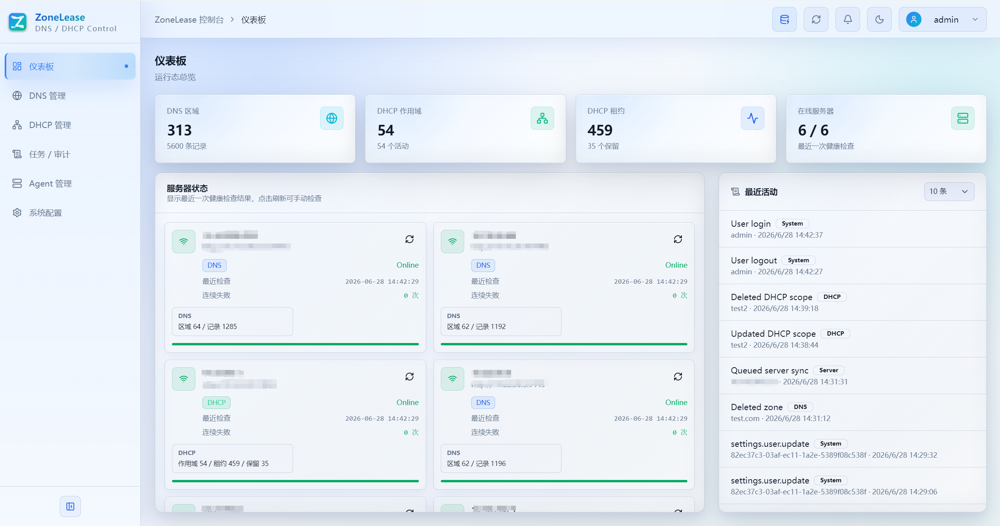

<div align="center">

<h1>ZoneLease</h1>

<p><b>Windows DNS / DHCP 可视化管理控制台</b> — 区域 · 记录 · 作用域 · 租约 · 保留地址 · 审计</p>

<p><b>简体中文</b> · <a href="README.en.md">English</a></p>

Windows DNS 和 DHCP 平时散在 Server Manager、DNS 管理器和一条条 PowerShell 命令里，改错一步没有回退，也没有人知道谁改了什么。  
ZoneLease 把它们收进一套**自托管**的控制台：Go 后端 + React 控制台 + PostgreSQL/Redis，轻量 Agent 落在 Windows 服务器上代为执行 PowerShell。  
多台 Windows Server 的 DNS/DHCP 在一个界面里统管，变更先落真实服务器再收敛数据库快照，每一步操作都有审计可查。

<p>
  <a href="LICENSE"></a>
  <a href="https://go.dev/"></a>
  <a href="https://react.dev/"></a>
  <a href="https://www.postgresql.org/"></a>
  
</p>

<p>
  <b><a href="#项目预览">项目预览</a></b> ·
  <a href="#它做什么">它做什么</a> ·
  <a href="#怎么工作">怎么工作</a> ·
  <a href="#技术栈">技术栈</a> ·
  <a href="#快速开始">快速开始</a> ·
  <a href="#部署">部署</a> ·
  <a href="#权限模型">权限</a> ·
  <a href="#数据与安全">安全</a> ·
  <a href="#常见问题">常见问题</a> ·
  <a href="#项目结构">项目结构</a> ·
  <a href="#文档">文档</a>
</p>

</div>

---

## 项目预览

### 登录

支持本地密码、AD/LDAP 与企业微信扫码登录，找回密码走图形验证码 + 邮箱验证码。



### 首页

仪表板汇总 DNS 区域、DNS 记录、DHCP 作用域、租约与服务器在线状态；服务器状态卡片支持手动刷新与定时健康检查，最近活动实时展示操作审计。



## 它做什么

- **DNS 管理** — 同步 Windows DNS 区域与记录快照，支持正向 / 反向区域创建、A / CNAME 记录创建、编辑与删除，勾选创建关联 PTR 记录并自动维护反向区域快照；同名互斥、CNAME 值格式、PTR 反向区域存在性等冲突在保存前校验。
- **DHCP 管理** — 通过 Agent 管理 Windows DHCP 作用域、排除范围、租约与保留地址，支持作用域创建 / 编辑 / 启停 / 删除、释放租约、保留地址创建 / 编辑 / 删除，操作成功后按作用域延迟合并局部同步数据库快照。
- **服务器管理** — 登记 Windows DNS / DHCP Agent 地址与可选 API Key，支持连接测试、手动同步、定时健康检查；离线判定次数、各类超时与并发都可在系统配置调整。
- **实时刷新** — 全量刷新、单 Agent 同步、DNS 区域刷新、DHCP 作用域刷新统一走后台任务，进度经 Redis 发布 SSE 事件；操作后的局部刷新按目标延迟合并，避免频繁操作拖垮采集。
- **用户与权限** — 本地密码、AD/LDAP 与企业微信扫码登录（支持直连企微与统一认证中心两种方式）、找回密码（图形验证码 + 邮箱验证码）、企微账号绑定 / 解绑；内置 `admin` / `operator` / `viewer` 三角色，自定义角色从 20 项权限勾选，前端隐藏无权入口，后端逐接口校验。
- **操作审计与通知** — 登录、服务器、DNS、DHCP、刷新、认证配置等关键操作全量写审计；Agent 离线与平台基础服务异常进入右上角通知中心，恢复后自动清空。
- **系统配置** — 基础配置（品牌、安全时效、同步参数、Agent 判定）、用户 / 群组 / 角色权限、认证配置（AD/LDAP 与企业微信）、邮件媒介（找回密码验证码）。

**它不是** DNS/DHCP 的自动发现或监控平台：ZoneLease 管的是「可视化管理 + 变更审计 + 快照查看」，不做网络扫描，不采集指标，也不代理 zone 传输。

同一件事，两种做法大致是这样：

| 现场 | 手工 PowerShell / Server Manager | 用 ZoneLease |
| --- | --- | --- |
| 改一条记录 | 远程到服务器敲命令，路径敲错就返工 | 界面操作，保存前先校验冲突 |
| 谁改的 | 无据可查 | 按操作 / 目标 / 结果全量审计 |
| 多台服务器 | 一台台远程 | Agent 统一登记，界面切换管理 |
| PTR 反向记录 | 手动去反向区域补 | 勾选联动创建，快照同步维护 |
| 离线发现 | 等业务报障 | 定时健康检查 + 通知中心告警 |
| 权限 | 共享管理员密码 | 20 项权限逐接口校验 |

## 怎么工作

```text
        浏览器
           │  http
           ▼
  ┌────────────────────────────────────────────┐
  │  Nginx（容器内或宿主机）                      │
  │  /            → 前端 SSR                    │
  │  /api/ · /swagger/ → Go 后端                │
  └────────────────────────────────────────────┘
        │                        │
        ▼                        ▼
  React 19 控制台            Go 1.25 后端
  Nitro SSR :5173            net/http :8080
        │                        │
        │              ┌─────────┴─────────┐
        │              ▼                   ▼
        │        PostgreSQL 17         Redis 7
        │        快照与审计            SSE 事件与短期锁
        │                                 │
        └──────────┐                      │
                   ▼                      │
        ┌──────────────────────┐          │
        │ Windows Agent（xN）  │◀── HTTPS ┘
        │  dns-agent           │  健康检查 / 采集 / 变更
        │  dhcp-agent          │  → Windows PowerShell
        └──────────────────────┘
```

- **谁负责什么** — 控制台读取 PostgreSQL 快照展示 DNS/DHCP 数据；创建、编辑、删除等变更由后端转发到对应 Windows Agent 执行 PowerShell，成功后再更新数据库快照并写审计。
- **数据放哪** — PostgreSQL 是快照与审计的事实来源；Redis 只承载 SSE 刷新事件、最近事件回放、刷新任务进度与短期分布式锁，不存业务数据。
- **Agent 边界** — Agent 只暴露 `/health` 与 DNS/DHCP 资源接口，按 `X-API-Key` 鉴权；Windows Server 2008/2008 R2 走 legacy 兼容脚本，新版本走 Go Agent。
- **对外暴露** — 只有健康检查、登录、公开认证方式、企业微信回调、找回密码流程与品牌信息可匿名访问，其余接口一律要求 `Authorization: Bearer <token>`。

## 技术栈

| 层 | 选型 |
| --- | --- |
| 后端语言 | Go 1.25+ |
| HTTP 服务 | 标准库 `net/http`（Go 1.22+ 方法路由） |
| 数据库 | PostgreSQL 17（[jackc/pgx](https://github.com/jackc/pgx) v5） |
| 缓存与事件 | Redis 7（[redis/go-redis](https://github.com/redis/go-redis) v9） |
| 认证与加密 | Bearer 会话（bcrypt 存储）、AD/LDAP（go-ldap/ldap v3）、企业微信 OAuth 扫码登录（直连 / 统一认证中心 SSO） |
| API 文档 | swag + http-swagger（Swagger UI） |
| 前端框架 | React 19 + TanStack Start / Router |
| 语言与构建 | TypeScript 5 + Vite 7 + Nitro |
| 样式与组件 | Tailwind CSS v4、Radix UI、lucide-react、sonner |
| Windows 采集 | dns-agent / dhcp-agent（Go + PowerShell），2008/2008 R2 提供 legacy 脚本 |
| 运行时打包 | Docker（Nginx + Supervisor 多进程） |

## 快速开始

本地开发需要 **Go 1.25+**、**Node.js 20+**、**PostgreSQL 17** 与 **Redis 7**。

```bash
git clone https://github.com/zyx3721/zonelease.git
cd zonelease
```

**数据库**

```bash
createdb -U postgres zonelease   # 或用 psql / 图形工具创建
```

**后端**

```bash
cd backend
cp .env.example .env      # 按需修改数据库、Redis 连接与 JWT_SECRET
go run cmd/server/main.go
```

后端默认监听 `http://127.0.0.1:8080`，首次启动自动执行迁移并创建默认管理员 `admin / 123456`。

**前端**（另开一个终端）

```bash
cd frontend
npm install
npm run dev
```

前端默认运行在 `http://localhost:5173`，开发服务器会把 `/api` 反向代理到后端。

打开 `http://localhost:5173`，使用 `admin / 123456` 登录，**登录后立刻改密码**。Swagger 在 `http://127.0.0.1:8080/swagger/index.html`。

Windows 服务器侧还需部署 Agent 才能采集与变更，详见 [《完整手册》第五章](docs/manual.md)。

## 部署

只保留两种方式：**Docker 部署**（推荐）与 **Release 二进制部署**。源码编译与 systemd 直跑的完整过程见 [《完整手册》](docs/manual.md)。

### 方式一：Docker 部署

镜像内置 Go 后端、Nginx 与前端 Nitro SSR，由 Supervisor 管理多进程，对外只暴露 80 端口；PostgreSQL 与 Redis 建议用仓库自带的 Compose 编排一起拉起：

```bash
git clone https://github.com/zyx3721/zonelease.git && cd zonelease/deploy
# 先准备 backend/.env（可从 backend/.env.example 复制修改）
docker compose up -d
```

Compose 会创建 `zonelease-postgres`、`zonelease-redis` 与 `zonelease` 三个容器，应用镜像为 `registry.cn-shenzhen.aliyuncs.com/zyx3721/zonelease:latest`（Docker Hub 同步发布 `zyx3721/zonelease`）。

核心环境变量（完整清单见 [《完整手册》6.8 节](docs/manual.md)）：

| 变量 | 默认值 | 说明 |
| --- | --- | --- |
| `JWT_SECRET` | 空 | 找回密码验证码与企业微信 OAuth state 的签名密钥，不影响已登录会话；生产环境必须显式设置为足够随机的长字符串 |
| `SERVER_PORT` | `8080` | 后端监听端口，容器内由 Nginx 反代，保持默认即可 |
| `SERVER_MODE` | `release` | 运行模式；`release` 下找回密码不回显调试验证码 |
| `DB_HOST` / `DB_PORT` | `localhost` / `5432` | PostgreSQL 连接地址 |
| `DB_NAME` / `DB_USER` / `DB_PASSWORD` | `zonelease` / `zonelease` / `zonelease_dev` | 数据库与账号 |
| `REDIS_ADDR` | `localhost:6379` | Redis 连接地址 |
| `JWT_EXPIRE_HOURS` | `12` | 登录会话有效期（小时），对账号密码、LDAP、企业微信登录统一生效，无空闲超时 |

服务管理：

```bash
docker compose ps                    # 查看运行状态
docker logs -f zonelease             # 查看实时日志
docker compose restart zonelease     # 重启
docker compose up -d --force-recreate zonelease   # 拉取新镜像后重建

# 升级到新镜像
docker pull registry.cn-shenzhen.aliyuncs.com/zyx3721/zonelease:latest
```

**访问**

- 控制台：`http://your-host/`，默认账号 `admin / 123456`
- 接口文档：`http://your-host/swagger/index.html`
- 健康检查：`http://your-host/api/health`

**最后一步**：在各台 Windows Server 上部署 `dns-agent` / `dhcp-agent`（legacy 系统用对应 PowerShell 脚本），再到控制台「Agent 管理」登记。步骤见 [《完整手册》第五章](docs/manual.md)。

### 方式二：Release 二进制部署

前往 [GitHub Releases](https://github.com/zyx3721/zonelease/releases) 页面，按自己的操作系统与 CPU 架构下载对应压缩包，再按下面步骤校验、解压、配置、启动。

**下载哪个包**

| 用途 | 下载文件 |
| --- | --- |
| 后端服务（Linux x86_64） | `zonelease_<版本>_linux_amd64.tar.gz` |
| 后端服务（Linux ARM64，鲲鹏、飞腾等） | `zonelease_<版本>_linux_arm64.tar.gz` |
| 前端界面（以上任意平台都需要） | `zonelease-frontend_<版本>.tar.gz` |
| DNS Agent（Windows x86_64 / ARM64） | `zonelease-dns-agent_<版本>_windows_amd64.zip` / `zonelease-dns-agent_<版本>_windows_arm64.zip` |
| DHCP Agent（Windows x86_64 / ARM64） | `zonelease-dhcp-agent_<版本>_windows_amd64.zip` / `zonelease-dhcp-agent_<版本>_windows_arm64.zip` |
| 校验和 | `zonelease-xxx_<版本>_checksums.txt` |

后端包内是 `zonelease` 可执行文件、`.env.example` 与 `README.txt`；前端包内是 Nitro SSR 的 `.output` 产物。二进制无外部运行时依赖，下载后可直接运行；前端 SSR 需要目标机器上安装 Node.js。Windows Agent 还需在对应服务器上部署，步骤见 [《完整手册》第五章](docs/manual.md)。

**1. 校验下载**

```bash
VERSION=1.0.1
mkdir -p /data/zonelease && cd /data/zonelease
sha256sum -c zonelease-frontend_${VERSION}_checksums.txt
```

**2. 解压**

```bash
mkdir -p backend frontend/.output
tar -xzf zonelease_${VERSION}_linux_amd64.tar.gz -C backend --strip-components=1
tar -xzf zonelease-frontend_${VERSION}.tar.gz -C frontend/.output
```

得到的目录结构：

```text
/data/zonelease/
├── backend/
│   ├── zonelease          # 后端二进制
│   ├── .env.example
│   └── data/              # 首次启动后生成
└── frontend/
    └── .output/
        ├── public/        # 浏览器静态资源
        └── server/
            └── index.mjs  # Nitro SSR 入口
```

**3. 配置并启动后端**

```bash
cd /data/zonelease/backend
cp .env.example .env
vim .env               # 至少设置 JWT_SECRET
./zonelease
```

后端默认监听 `127.0.0.1:8080`，首次启动自动执行迁移并创建默认管理员 `admin / 123456`。

后端同时支持命令行参数，显式传入的参数优先于环境变量与 `.env` 文件；`./zonelease -v` 可查看版本信息（版本、commit、构建时间），`./zonelease -h` 查看全部参数：

| 参数 | 等价环境变量 | 说明 |
| --- | --- | --- |
| `-host` | `SERVER_HOST` | 后端监听地址 |
| `-port` | `SERVER_PORT` | 后端监听端口 |
| `-mode` | `SERVER_MODE` | 运行模式 `release` 或 `debug` |
| `-db-host` | `DB_HOST` | PostgreSQL 主机 |
| `-db-port` | `DB_PORT` | PostgreSQL 端口 |
| `-db-name` | `DB_NAME` | PostgreSQL 数据库名 |
| `-db-user` | `DB_USER` | PostgreSQL 用户 |
| `-db-password` | `DB_PASSWORD` | PostgreSQL 密码 |
| `-db-sslmode` | `DB_SSLMODE` | PostgreSQL SSL 模式 |
| `-redis-addr` | `REDIS_ADDR` | Redis 地址 |
| `-redis-password` | `REDIS_PASSWORD` | Redis 密码 |
| `-redis-db` | `REDIS_DB` | Redis 库编号 |
| `-jwt-secret` | `JWT_SECRET` | 找回密码验证码与企业微信 OAuth state 的签名密钥 |
| `-session-ttl` | `JWT_EXPIRE_HOURS` | 登录会话有效期（小时） |
| `-dns-sync-interval` | `RUNTIME_DNS_DEEP_SYNC_INTERVAL` | DNS 深度同步间隔（如 1h、1d） |
| `-dhcp-sync-interval` | `RUNTIME_DHCP_DEEP_SYNC_INTERVAL` | DHCP 深度同步间隔（如 1h、1d） |
| `-metric-retention-days` | `METRIC_RETENTION_DAYS` | 指标数据保留天数 |
| `-log-retention-days` | `LOG_RETENTION_DAYS` | 日志数据保留天数 |
| `-metric-stream-maxlen` | `METRIC_STREAM_MAXLEN` | Redis 指标流最大长度 |
| `-cors-origin` | `CORS_ORIGIN` | 允许的跨域来源 |
| `-env` | 无 | 指定 `.env` 配置文件路径 |
| `-v`、`-version` | 无 | 显示版本信息并退出 |

需要常驻时交给 systemd：

```ini
# /etc/systemd/system/zonelease-backend.service
[Unit]
Description=ZoneLease Backend
After=network.target postgresql.service redis.service

[Service]
Type=simple
WorkingDirectory=/data/zonelease/backend
ExecStart=/data/zonelease/backend/zonelease
Restart=on-failure
RestartSec=5

[Install]
WantedBy=multi-user.target
```

```bash
systemctl daemon-reload && systemctl enable --now zonelease-backend
```

**4. 启动前端 SSR**

```bash
cd /data/zonelease/frontend
SSR_API_ORIGIN=http://127.0.0.1:8080 HOST=127.0.0.1 PORT=5173 node .output/server/index.mjs
```

SSR 进程启动时会访问后端拉取品牌配置，把站点名与图标直出进首帧 HTML。后端地址按以下顺序确定：运行时环境变量 `SSR_API_ORIGIN` → 入口文件 `index.mjs` 所在目录向上任意一层的 `.env` 文件（首个存在的生效，可与后端共用部署根目录的同一份 `.env`）→ 默认 `http://127.0.0.1:8080`（开发模式下会先回退到 `VITE_API_BASE_URL`，与 dev 代理同源）。请确保该地址对 SSR 进程可达，否则首屏会先显示默认品牌、加载后再切换为配置值，SSR 进程日志会输出 `[zonelease-ssr] fetch brand failed` 警告。

**5. 用 Nginx 收口**

```nginx
server {
    listen 80;
    server_name your-domain.com;

    # 前端静态资源：直接读取 .output/public，避免 JS/CSS 经过 SSR 服务
    location ^~ /assets/ {
        root /data/zonelease/frontend/.output/public;
        try_files $uri =404;
        access_log off;
        expires 1y;
        add_header Cache-Control "public, immutable";
    }

    # 站点图标
    location = /favicon.svg {
        root /data/zonelease/frontend/.output/public;
        try_files $uri =404;
        access_log off;
        expires 7d;
        add_header Cache-Control "public";
    }

    # SSE 长连接接口：关闭代理缓冲，避免刷新事件被缓存
    location = /api/events {
        proxy_pass http://127.0.0.1:8080;
        proxy_http_version 1.1;
        proxy_set_header Connection "";
        proxy_set_header Host $host;
        proxy_set_header X-Real-IP $remote_addr;
        proxy_set_header X-Forwarded-For $proxy_add_x_forwarded_for;
        proxy_set_header X-Forwarded-Proto $scheme;
        proxy_buffering off;
        proxy_cache off;
        proxy_read_timeout 1h;
        proxy_send_timeout 1h;
        add_header X-Accel-Buffering no;
    }

    location /swagger/ {
        proxy_pass http://127.0.0.1:8080;
        proxy_set_header Host $host;
    }

    location /api/ {
        proxy_pass http://127.0.0.1:8080;
        proxy_set_header Host $host;
        proxy_set_header X-Real-IP $remote_addr;
        proxy_set_header X-Forwarded-For $proxy_add_x_forwarded_for;
        proxy_set_header X-Forwarded-Proto $scheme;
        proxy_read_timeout 600s;
    }

    location / {
        proxy_pass http://127.0.0.1:5173;
        proxy_set_header Host $host;
        proxy_set_header X-Real-IP $remote_addr;
        proxy_set_header X-Forwarded-For $proxy_add_x_forwarded_for;
        proxy_set_header X-Forwarded-Proto $scheme;
    }
    
    location = /health {
        proxy_pass http://127.0.0.1:8080/api/health;
    }
}
```

前端必须经 `node .output/server/index.mjs` 提供 SSR；**只把 `.output/public` 配成静态根目录会导致服务端渲染页面无法返回**。含 HTTPS 与 80→443 跳转的完整示例见 [《完整手册》4.4 节](docs/manual.md)。

**6. 部署 Windows Agent 并访问**

把对应架构的 DNS / DHCP Agent zip 解压到各 Windows Server，配置 API Key 与采集参数后启动，再到控制台「Agent 管理」登记。步骤见 [《完整手册》第五章](docs/manual.md)。

访问同 Docker 方式：控制台 `http://your-domain.com`（`admin / 123456`）、接口文档 `/swagger/index.html`、健康检查 `/api/health`。


## 权限模型

接口按角色权限逐个校验，无权限返回 403；权限 Key 形如 `模块.资源.操作`，共 20 项。

| 身份 | 默认权限 |
| --- | --- |
| 默认管理员 `admin` | 全部 20 项 |
| 内置角色 `admin` | 全部 20 项 |
| 内置角色 `operator` | DNS/DHCP 查看 + 管理、服务器查看 + 管理、刷新、导出、通知管理、审计查看与其余系统配置只读 |
| 内置角色 `viewer` | 全部只读：仪表板、DNS/DHCP、服务器、审计与系统设置查看 |
| 自定义角色 | 从 20 项中勾选 |

按模块划分：

- **仪表板** — `dashboard.read`
- **DNS 管理** — `dns.read` / `dns.manage`
- **DHCP 管理** — `dhcp.read` / `dhcp.manage`
- **服务器管理** — `servers.read` / `servers.manage`
- **刷新 / 导出** — `refresh.manage`、`export.manage`
- **审计 / 通知** — `audit.read`、`notifications.read` / `notifications.manage`
- **系统配置** — `settings.{base|users|auth|notifications}.read` / `.manage`

## 数据与安全

- **先改默认密码** — 首次部署后立即修改 `admin` 的默认口令。
- **显式设置 JWT 密钥** — 生产环境必须在 `.env` 中设置 `JWT_SECRET`；该密钥用于找回密码验证码与企业微信 OAuth state 签名，轮换后已登录会话不受影响，进行中的找回密码流程需重新开始。
- **Agent 鉴权** — Windows Agent 建议配置 `X-API-Key`，控制台侧按服务器保存；legacy Agent 同样支持 API Key。
- **凭据脱敏** — LDAP 绑定密码、企微应用 Secret / 应用对接密钥、SMTP 密码落库保存，接口回显只返回「已配置」标记。
- **审计边界** — 请求格式错误、认证失败等前置失败不写审计，避免污染操作记录；成功变更全量落审计。
- **收紧访问** — 生产环境通过 Nginx 配置 HTTPS 并限制来源 IP；完整示例见 [《完整手册》4.4 节](docs/manual.md)。

## API 文档

后端集成 Swagger/OpenAPI，启动后即可查看在线接口文档：

- **Swagger UI**：`http://localhost:8080/swagger/index.html`
- **OpenAPI JSON**：`http://localhost:8080/swagger/doc.json`
- **健康检查**：`GET /api/health`

无需认证的接口只有：`POST /api/auth/login`、`GET /api/auth/providers`、`GET /api/auth/wecom/authorize`、`GET /api/auth/wecom/callback`、`POST /api/auth/wecom/exchange`、`POST /api/auth/wecom/login`、`POST /api/auth/logout`、`GET /api/auth/me`、`GET /api/auth/password-reset/captcha`、`POST /api/auth/password-reset/verify`、`POST /api/auth/password-reset/send`、`POST /api/auth/password-reset/confirm`、`GET /api/public/base`、`GET /api/events`、`GET /api/health`；其余接口均需在请求头携带 `Authorization: Bearer <token>`。

登录请求示例：

```json
{
  "username": "admin",
  "password": "123456"
}
```

按模块分组的完整接口清单（认证、找回密码、DNS、DHCP、实时事件、健康检查、通知中心、系统配置、刷新、服务器、状态、Agent API）见 [《完整手册》十、API 文档](docs/manual.md)。

修改接口后，在 `backend/` 目录执行以下命令同步 Swagger 产物：

```bash
swag init -g cmd/server/main.go -o docs
```

## 数据库

PostgreSQL 数据库，默认由后端首次启动自动执行 `migrations/001_init.sql` 与 `002_user_wecom_bindings.sql` 初始化，共 22 张表。

| 分组 | 表 |
| --- | --- |
| 用户与认证 | `users`、`sessions`、`password_reset_requests`、`auth_providers`、`user_wecom_bindings`、`roles`、`user_roles`、`user_groups`、`user_group_members`、`user_group_roles` |
| DNS / DHCP 快照 | `servers`、`dns_zones`、`dns_records`、`dhcp_scopes`、`dhcp_leases`、`dhcp_reservations`、`dhcp_exclusions` |
| 配置与运行记录 | `system_settings`、`notification_channels`、`audit_entries`、`refresh_tasks`、`notifications` |

## 常见问题

**首次登录账号是什么？**

后端首次启动且用户表为空时创建 `admin / 123456`，登录后请立即在右上角用户菜单修改密码。

**为什么重启后已有 Token 失效？**

会话令牌保存在 PostgreSQL `sessions` 表，重启不影响；失效通常是会话超过有效期。会话有效期由 `JWT_EXPIRE_HOURS` 控制（默认 12 小时），无空闲超时与自动续期。

**DNS 页面没有区域或记录怎么办？**

先在「Agent 管理」确认对应 Windows 服务器已登记且健康检查在线，然后点击右上角「全量刷新」或单 Agent「同步 Agent」拉取快照。

**怎么启用 AD/LDAP 登录？**

在「系统配置 → 认证配置」填好 LDAP 连接参数并启用（支持连接测试）；外部账号也必须先在「用户配置」中创建并启用同名用户。

**怎么启用企业微信扫码登录？**

在「系统配置 → 认证配置 → 企业微信」选择接入模式：**直连企业微信**需在企微管理后台创建自建应用（记录 corpid、AgentID、Secret），把本系统域名加入应用的可信回调域名与可信 IP；**统一认证中心**则填写 wecom-auth-center 地址、应用标识与应用密钥，认证中心侧为本系统配置 `domain` 与 `callback_path: /login`。用户先用账号密码登录，在右上角菜单「绑定企微」扫码完成关联，之后即可在登录页选择企业微信扫码登录；只有已绑定平台用户的企微账号才能扫码登录。

**Agent 显示 Offline 怎么排查？**

检查 Windows 服务器上 Agent 进程与端口连通性、`X-API-Key` 是否与登记一致、`DNS_AGENT_POWERSHELL_TIMEOUT_SECONDS` 等配置；2008/2008 R2 需使用 `dns-agent/legacy/`、`dhcp-agent/legacy/` 下的兼容脚本。

其余问题见 [《完整手册》九、常见问题](docs/manual.md)。

## 项目结构

```text
zonelease/
├── backend/                         # Go 后端控制中心
│   ├── api/router/                  # HTTP API 路由、处理函数、校验、Swagger 注解与文档模型
│   ├── cmd/server/                  # 后端启动入口
│   ├── config/                      # 后端环境变量配置加载
│   ├── docs/                        # 后端 Swagger/OpenAPI 生成文件
│   ├── internal/                    # 领域模型、PostgreSQL 仓储、Agent 客户端与认证 / 刷新 / 同步服务
│   ├── pkg/database/                # PostgreSQL 连接与初始化迁移
│   └── .env.example                 # 环境变量模板
├── dns-agent/                       # Windows DNS Agent（Go + PowerShell）
│   ├── cmd/dns-agent/               # 启动入口
│   ├── internal/                    # 配置、HTTP 服务与 DNS 采集 / 变更能力
│   └── legacy/                      # Windows Server 2008/2008 R2 兼容脚本
├── dhcp-agent/                      # Windows DHCP Agent（Go + PowerShell）
│   ├── cmd/dhcp-agent/              # 启动入口
│   ├── internal/                    # 配置、HTTP 服务与 DHCP 采集 / 变更能力
│   └── legacy/                      # 老版本系统兼容脚本（netsh）
├── frontend/                        # React 控制台
│   └── src/
│       ├── components/              # 主布局、启动页、统计卡片、弹窗与基础 UI 组件
│       ├── features/                # 认证、DNS、DHCP 与系统配置业务域组件
│       ├── lib/                     # 会话认证、品牌配置、刷新事件与通用工具
│       ├── routes/                  # TanStack Router 页面路由
│       ├── router.tsx               # 路由实例
│       ├── server.ts / start.ts     # React Start 服务端与启动入口
│       └── styles.css               # 全局样式与主题变量
├── deploy/                          # Docker Compose、Dockerfile、Nginx 与 Supervisor 配置
├── docs/                            # 完整手册与 DNS / DHCP / 刷新 / Redis 等运行链路文档
├── verchanglog/                     # 版本更新日志
├── AGENTS.md                        # 项目开发规范
├── LICENSE
└── README.md                        # 中文说明（本文件）
```

## 文档

| 先看这个 | 再往下 |
| --- | --- |
| [快速开始](#快速开始) | 本地起后端与前端，默认账号与端口 |
| [部署](#部署) | Docker 与源码编译两条路径、环境变量、Agent 部署 |
| [权限模型](#权限模型) | 20 项权限怎么分组、内置角色各有什么 |
| [完整手册](docs/manual.md) | 全量接口清单、逐步部署与 Nginx/HTTPS 示例、使用说明与排障 |
| [English README](README.en.md) | 同样的内容，英文版 |

## 版本历史

| 版本 | 发布日期 | 更新日志 |
| --- | --- | --- |
| v1.1.4 | 2026-09-23 | [verchanglog/v1.1.4.md](verchanglog/v1.1.4.md) |
| v1.1.3 | 2026-09-23 | [verchanglog/v1.1.3.md](verchanglog/v1.1.3.md) |
| v1.1.2 | 2026-09-22 | [verchanglog/v1.1.2.md](verchanglog/v1.1.2.md) |
| v1.1.1 | 2026-09-22 | [verchanglog/v1.1.1.md](verchanglog/v1.1.1.md) |
| v1.1.0 | 2026-09-20 | [verchanglog/v1.1.0.md](verchanglog/v1.1.0.md) |
| v1.0.1 | 2026-07-15 | [verchanglog/v1.0.1.md](verchanglog/v1.0.1.md) |
| v1.0.0 | 2026-06-29 | [verchanglog/v1.0.0.md](verchanglog/v1.0.0.md) |

各版本的发布说明见 [GitHub Releases](https://github.com/zyx3721/zonelease/releases)。

## 许可证

本项目采用 [MIT License](LICENSE) 开源协议。

## 联系方式

- **Email**：416685476@qq.com
- **GitHub Issues**：[zyx3721/zonelease/issues](https://github.com/zyx3721/zonelease/issues)
- **项目主页**：[github.com/zyx3721/zonelease](https://github.com/zyx3721/zonelease)

---

**⭐ 如果这个项目对您有帮助，欢迎 Star 支持！**
